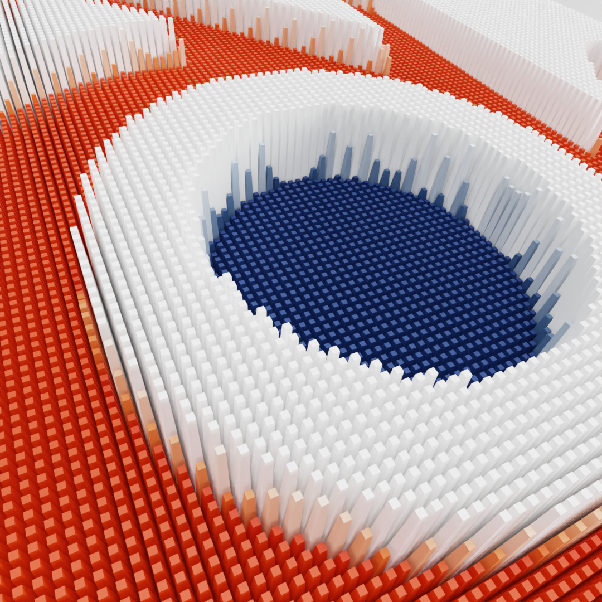
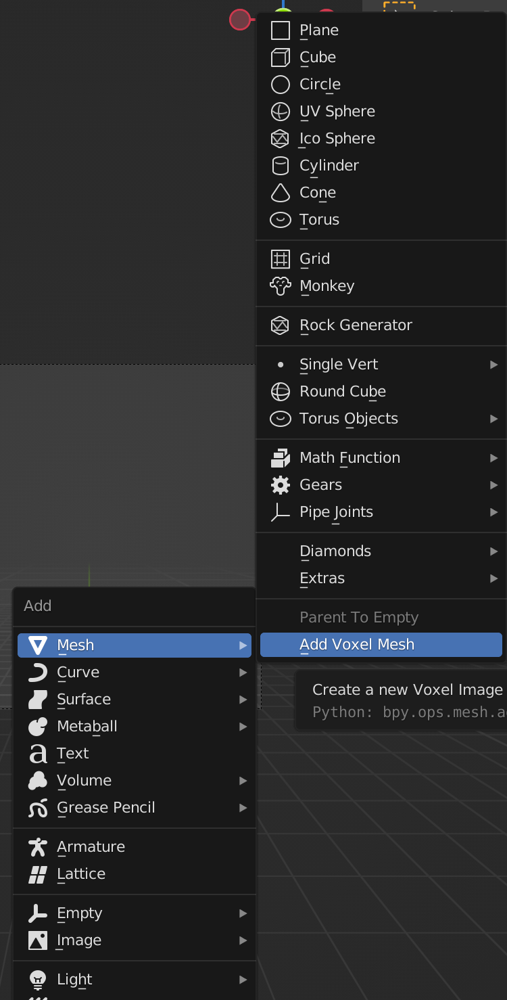
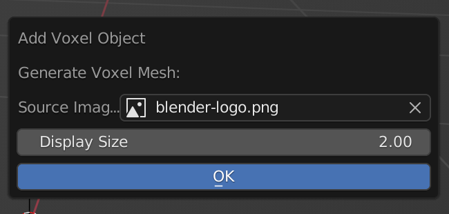

# Blender Image Voxel add-on

## What is it?

This add-on adds a new menu item to the 3D view `Add Mesh` menu
with the label `Add Voxel Mesh`. When you select that item a small dialog
opens asking for the final size of the mesh (width) and the source Image Data
Block. **The Image data block must already exist**.

I have used this plugin with images as large as 2000x2000 pixels, but I had to
wait a while for the mesh to generate. YMMV, I suggest starting experiments with
smaller images.

Meshes and objects created with this add-on are named `Voxel`, and appear in a
collection named `voxels`.

Meshes created with this add-on have a vertex color group called `voxel colors`

## Background:

This addon is the evolution to some [simple gists](https://gist.github.com/knowuh/48136d7a17387e7cf6c3).
This version:

- Adds a little bit of UI.
- Generates one mesh object instead of many. This makes it easier to manipulate the results.
- Uses the Blender BMesh python module to generate the mesh faster.
- Allows you to specify the final image size.
- Uses a vertex color layer to store pixel color data.

## Install instructions:

1. Download `image_voxel_add_on.py`
2. In the Blender preferences menu, select the Add-ons tab in the left.
3. Click on the `Instal ...` button in the top right of the interface.
4. Browse and select the downloaded `image_voxel_add_on.py` script,
and then click on the `Install Add-on` button.
5. Back in the Add-ons tab, make sure the checkbox next to the "Add Mesh: Image To Voxel" is ticked.
